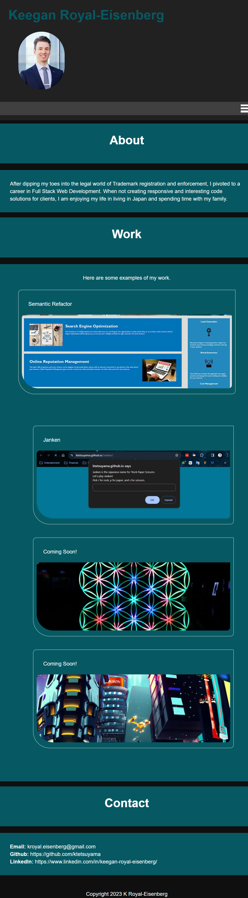

# Portfolio

## Description

My professional portfolio.

## Table of Contents

- [Introduction](#introduction)
- [Problem](#problem)
- [Solution](#solution)

## Introduction
I created this portfolio to showcase my projects and code samples.

## Problem

I am a budding full stack developer that wishes to show off the work that I have done so far in my career, but don't have an application to do so.

## Solution

 I created a portfolio application that is coded well on its own, but also showcases a selection of projects that I have worked. It can be easily updated in the future. I used "Mobile-First" design to make this portfolio look good on small screens, and also on desktop sized screens.

[Link to the deployed application]()

## Credits

I collaborated with George Schultz, Aster Oliva, Ailleen Nguyen, Nick Gambino, and John Young to troubleshoot any bugs that I had during development of this application.

Tutorials used:

[NetNinja Responsive Design tutorials on Youtube](https://www.youtube.com/watch?v=3tLb3i7GB38&list=PL4cUxeGkcC9g9Vh9MAA-XKnfJsWZnPZFw&ab_channel=NetNinja)

[w3schools page on adding favicons to webages](https://www.w3schools.com/html/html_favicon.asp)

[Text-underline-offset article](https://css-tricks.com/almanac/properties/t/text-underline-offset/#:~:text=The%20text%2Dunderline%2Doffset%20property,underlines%20from%20their%20initial%20position.&text=Once%20you%20apply%20an%20underline,text%2Dunderline%2Doffset%20property.)

[CSS Hover Animation article](https://blog.hubspot.com/website/css-hover-animation)

[Loremflickr for placeholder images](https://loremflickr.com/)

[Make a Card Clickable in CSS](https://dev.to/dmbf29/make-a-card-clickable-in-css-10fo)

## License

MIT License